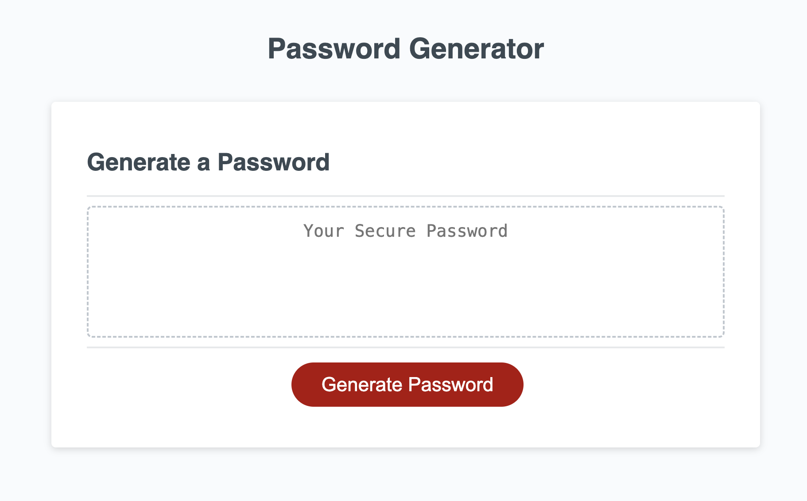
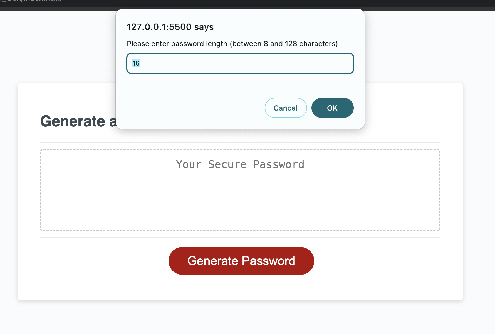
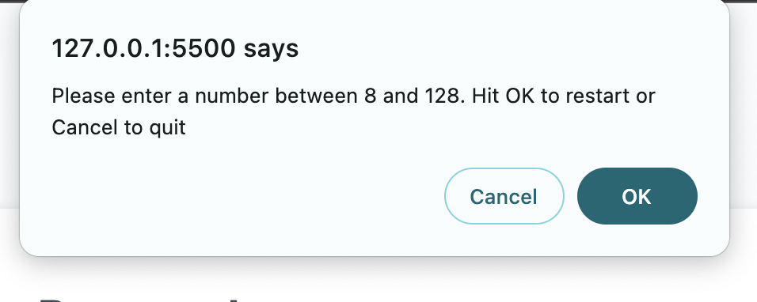
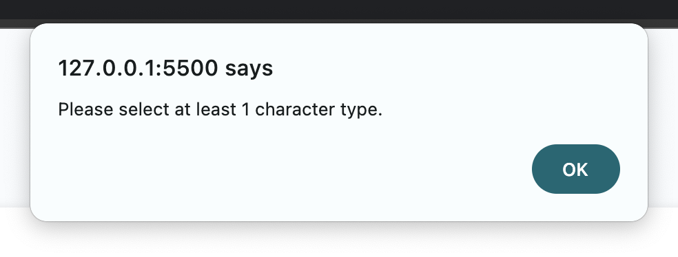
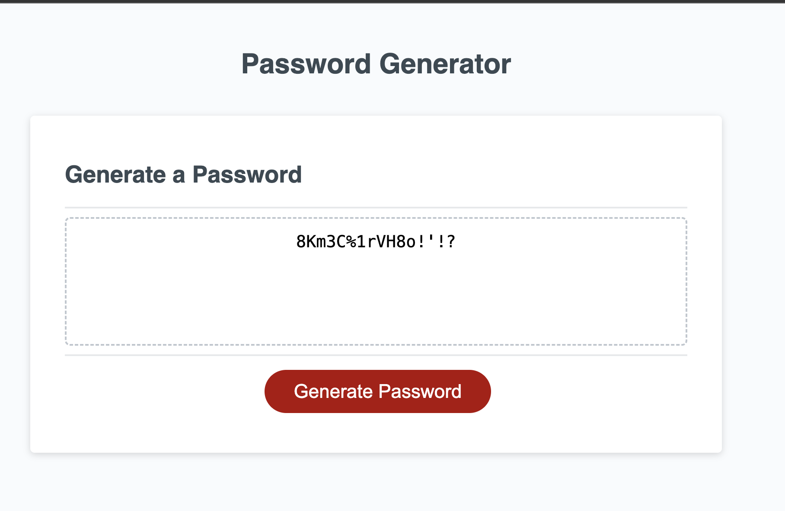

# 03 Password Generator
## Description
    I wanted a secure password that wouldn't be easily remembered. To achieve that, I built a JavaScript password generator. It let the user decide on the length of the password (between 8-128), and prompt the user to weather include numbers, lowercase, uppercase, or special characters. The user has pick a number between 8-128, and to include at lease one type of characters. If they don't, then there is a prompt to notify them, and the password won't be generated. 

## Installation
    Open the index.html in an internet browser

## Usage
    1. Open the index.html file in an internet browser. Click on the generate password button (image 1).

    2. You are then prompted to enter your desired password length between 8-128 characters, with 16 characters being the default (image 2). If the password length is less than 8 or more than 128 then a popup will alert the user (image 3). 

    3. Next is if the user wants to include numbers, lowercase, uppercase, or special characters in the password. At lease one type of character has to be pick, or an alert will pop up saying "At least 1 type of character has to be pick" (image 4).

    4.  The password will generate when all the criteria are met (image 5).
    

## Credits
    Michael Nguyen

    Use code from this site to shuffle the array. Fisher-Yates algorithm: https://dev.to/codebubb/how-to-shuffle-an-array-in-javascript-2ikj#:~:text=The%20first%20and%20simplest%20way

    EdX AI chat to help figure out some problems with code such as deleting semi-colons `;`.

## Additional Sources

- MDN parseInt(): https://developer.mozilla.org/en-US/docs/Web/JavaScript/Reference/Global_Objects/parseInt

- Window: confirm(): https://developer.mozilla.org/en-US/docs/Web/API/Window/confirm

- MDN Arrays: https://developer.mozilla.org/en-US/docs/Web/JavaScript/Reference/Global_Objects/Array

- MDN Array Methods: https://developer.mozilla.org/en-US/docs/Web/JavaScript/Reference/Global_Objects/Array#Instance_methods

- MDN Math.random(): https://developer.mozilla.org/en-US/docs/Web/JavaScript/Reference/Global_Objects/Math/random

- MDN querySelector(): https://developer.mozilla.org/en-US/docs/Web/API/Document/querySelector

- MDN concat(): https://developer.mozilla.org/en-US/docs/Web/JavaScript/Reference/Global_Objects/Array/concat

## License
    MIT License

    Copyright (c) [2023] [Michael Nguyen]

    Permission is hereby granted, free of charge, to any person obtaining a copy of this software and associated documentation files (the "Software"), to deal in the Software without restriction, including without limitation the rights to use, copy, modify, merge, publish, distribute, sublicense, and/or sell copies of the Software, and to permit persons to whom the Software is furnished to do so, subject to the following conditions:

    The above copyright notice and this permission notice shall be included in all  copies or substantial portions of the Software.

    THE SOFTWARE IS PROVIDED "AS IS", WITHOUT WARRANTY OF ANY KIND, EXPRESS OR IMPLIED, INCLUDING BUT NOT LIMITED TO THE WARRANTIES OF MERCHANTABILITY, FITNESS FOR A PARTICULAR PURPOSE AND NONINFRINGEMENT. IN NO EVENT SHALL THE AUTHORS OR COPYRIGHT HOLDERS BE LIABLE FOR ANY CLAIM, DAMAGES OR OTHER LIABILITY, WHETHER IN AN ACTION OF CONTRACT, TORT OR OTHERWISE, ARISING FROM, OUT OF OR IN CONNECTION WITH THE SOFTWARE OR THE USE OR OTHER DEALINGS IN THE SOFTWARE.